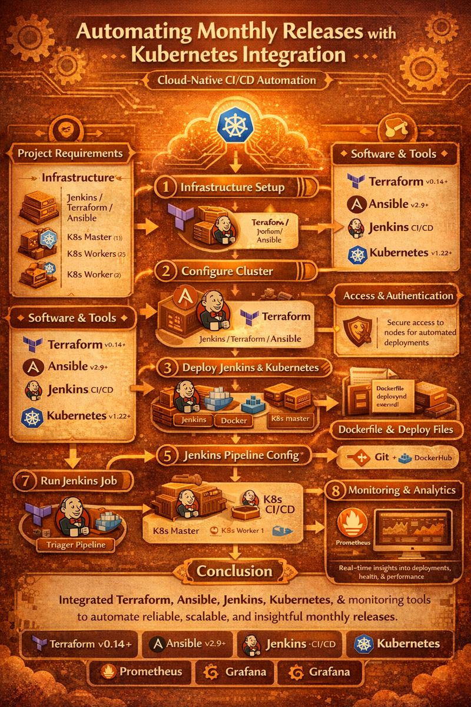

<p align="center">
  
</p>

<h1 align="center">☕ Automating Monthly Releases with Kubernetes Integration</h1>

<p align="center">
  
  
  
  
  
  
  
  
  
</p>
---

## 🧭 Architecture

<p align="center">
  
</p>


---

## 🌿 Project Overview

This project demonstrates a **cloud-native DevOps release automation workflow** designed to support **predictable monthly releases** using modern infrastructure and orchestration tools.

The solution automates the entire lifecycle:
- **Infrastructure provisioning** using Terraform  
- **Configuration management** with Ansible  
- **CI/CD orchestration** via Jenkins  
- **Containerized deployments** on Kubernetes  
- **Observability & monitoring** using Prometheus and Grafana  

The architecture focuses on **scalability, reliability, and repeatability**, ensuring smooth and controlled releases with minimal manual intervention.

---

## 📚 Table of Contents

- [Infrastructure Setup](#infrastructure-setup)
- [Installation](#installation)
- [Configuration](#configuration)
- [CI/CD Pipeline](#ci-cd-pipeline)
- [Monitoring and Analytics](#monitoring-and-analytics)
- [Conclusion](#conclusion)

---

# Project Requirements  

## 🏗️ 1. Infrastructure Requirements  

To ensure seamless deployment and automation, the following infrastructure components are required:  

### 🖥️ Compute Instances  

| Instance                         | Role & Purpose                          | CPU  | RAM   | Storage  | OS                  |
|----------------------------------|------------------------------------|------|------|---------|--------------------|
| **Jenkins_Terraform_Ansible** | Automation & Provisioning           | 4 vCPUs  | 8GB   | 50GB SSD  | Ubuntu 22.04 / CentOS 8  |
| **Kubernetes Master (Kmaster)** | Controls Kubernetes Cluster        | 4 vCPUs  | 16GB  | 100GB SSD | Ubuntu 22.04 / CentOS 8  |
| **Kubernetes Worker (Kslave1)** | Runs containerized applications    | 4 vCPUs  | 8GB   | 100GB SSD | Ubuntu 22.04 / CentOS 8  |
| **Kubernetes Worker (Kslave2)** | Ensures load balancing & scaling  | 4 vCPUs  | 8GB   | 100GB SSD | Ubuntu 22.04 / CentOS 8  |

### 🌐 Networking & Security  

- **Private IP Connectivity** – All nodes must communicate securely.  
- **Firewall Rules:**  
  - **Jenkins:** `8080`  
  - **Kubernetes API:** `6443`  
  - **Prometheus:** `9090`  
  - **Grafana:** `3000`  
  - **SSH Access:** `22` (for remote management)  
- **VPC/Subnet Configuration** – For Kubernetes networking.  

---

## 🛠️ 2. Software & Tools Requirements  

### Infrastructure as Code (IaC)  
- **Terraform (v0.14+)** – Infrastructure provisioning.  
-  **Ansible (v2.9+)** – Automated configuration management.  

### CI/CD Pipeline  
- **Jenkins** – Continuous Integration & Deployment.  
-  **Git** – Version control & repository management.  
- **Docker** – Containerized builds & deployments.  

### Kubernetes Ecosystem  
- **Kubernetes (v1.22+)** – Container orchestration.  
- **Kubectl** – Kubernetes cluster management.  
- **Kubeadm** – Kubernetes cluster setup.  

### Monitoring & Logging  
-  **Prometheus** – System monitoring & alerting.  
-  **Grafana** – Performance visualization dashboard.  

---

## 🔐 3. Access & Authentication Requirements  
-  **SSH Key-Based Authentication** – Secure communication between nodes.  
-  **Jenkins User Permissions** – Grant access for pipeline execution.  
- **Kubernetes RBAC (Role-Based Access Control)** – Secure cluster operations.  

---


---
## 🚀 Infrastructure Setup  

###  Instances & Roles  

| Instance                        | Role & Responsibilities                                  |
|----------------------------------|----------------------------------------------------------|
| **Jenkins_Terraform_Ansible** | Manages automation, infrastructure provisioning, and CI/CD pipeline. |
| **Kmaster**                   | Kubernetes Master Node – Controls cluster management and API server. |
| **Kslave1**                   | Kubernetes Worker Node 1 – Runs workloads and manages containerized applications. |
| **Kslave2**                   | Kubernetes Worker Node 2 – Ensures load distribution and scalability. |

### Networking Requirements
- Ensure all nodes can communicate over SSH and required ports.
- Open ports for Jenkins (8080), Kubernetes API, and other necessary services.

---
## Installation
### **Step 1: Provision Infrastructure with Terraform**
#### Install Terraform:
```bash
wget -O- https://apt.releases.hashicorp.com/gpg | sudo gpg --dearmor -o /usr/share/keyrings/hashicorp-archive-keyring.gpg
echo "deb [signed-by=/usr/share/keyrings/hashicorp-archive-keyring.gpg] https://apt.releases.hashicorp.com $(lsb_release -cs) main" | sudo tee /etc/apt/sources.list.d/hashicorp.list
sudo apt update && sudo apt install terraform -y
```

#### Define Infrastructure in `main.tf`:
> [!NOTE]
> Available in the Repository with the name of the ***main.tf***
#### Apply Terraform Configuration:
```bash
terraform init
terraform plan
terraform apply
```
> [!IMPORTANT]  
> **Infrastructure as Code (IaC)**  
> This project utilizes **Terraform** for provisioning infrastructure and **Ansible** for automated configuration.  
> - Ensures consistent, scalable, and repeatable deployments.  
> - Reduces manual intervention.  
---
## Configuration
### **Step 2: Install Ansible & Configure Cluster**
#### Install Ansible on `Jenkins_Terraform_Ansible`:
```bash
sudo apt update
sudo apt install software-properties-common
sudo add-apt-repository --yes --update ppa:ansible/ansible
sudo apt install ansible -y
```

#### Set Up SSH Key-Based Authentication:
```bash
ssh-keygen
sudo cat ~/.ssh/id_rsa.pub
```
Copy the key to `~/.ssh/authorized_keys` on **Kmaster, Kslave1, Kslave2**.

> [!IMPORTANT]  
> **Security & Access Control**  
> - **SSH Key-Based Authentication** for server access.  
#### Configure Ansible Inventory (`/etc/ansible/hosts`):
```ini
[kmaster]
<Private-IP-of-Kmaster>

[workers]
<Private-IP-of-Kslave1>
<Private-IP-of-Kslave2>
```

#### Test Connectivity:
```bash
ansible -m ping all
```

---
### **Step 3: Deploy Jenkins & Kubernetes**

The installation process is automated using an **Ansible playbook (`playbook.yaml`)**. Below are the required setup scripts, which are available in the repository.

#### Install Java, Jenkins & Docker on `Jenkins_Terraform_Ansible`
> 📜 **Note:** The installation is managed by the script [`Jenkins_terraform_ansible.sh`](./Jenkins_terraform_ansible.sh).  

#### Install Java & Docker on `Kmaster`
> 📜 **Note:** The installation is managed by the script [`Kmaster.sh`](./Kmaster.sh).  
---

#### Perform Syntax Check
Before running the playbook, check for any syntax errors:

```bash
ansible-playbook playbook.yaml --syntax-check
```
#### Dry Run (Check Mode)
Perform a dry run to preview the changes without applying them:
```bash
ansible-playbook playbook.yaml --check
```
#### Execute the Playbook
Run the Ansible playbook to configure the infrastructure:
```bash
ansible-playbook playbook.yaml
```
#### Install Kubernetes on `Kmaster, KWorker 1, Kworker 2`
> [!NOTE]
> Available in the Repository with the name of the ***play.yaml***
> [!IMPORTANT]  
> **Scalability & High Availability**  
> Kubernetes ensures:  
> - **Dynamic scaling** & **load balancing**  
> - **High availability** & **fault tolerance**  

### **Step 4: Create Required Deployment Files**  
After successfully running the Ansible playbook, create the following files for deployment:  

📝 **1. [Dockerfile](./Dockerfile)**  
Defines the container image configuration for the application.  

📝 **2. [deploy.yml](./deploy.yml)**  
Kubernetes deployment file to manage application deployment.  

📝 **3. [SVC.yml](./SVC.yml)**  
Kubernetes service file to expose the application within the cluster.  

> 📜 **Note:** These files are available in the repository with the same file names.  

---

### **Step 5: Configure Jenkins for Deployment**  
After creating the deployment files, set up Jenkins for seamless integration with Kubernetes.  

> 📜 **Note:** Ensure Jenkins is installed and accessible before proceeding.  

#### **Open Jenkins Dashboard and Add K-Master Machine**  
1. Navigate to the **Jenkins Dashboard**.  
2. Add the **K-Master** machine as a node for deployment.  

#### **Configure DockerHub Credentials in Jenkins**  
1. Go to **Manage Jenkins** → **Credentials**.  
2. Click on **Global Credentials (unrestricted)**.  
3. Click **Add Credentials** and select:  
   - **Username:** Your DockerHub username  
   - **Password:** Your DockerHub password  
4. Click **Save** to store the credentials securely.  

---
> [!IMPORTANT]  
> **Security & Access Control**  
> - **Jenkins Credentials Management** secures secrets & environment variables.  
### **Step 6: Create a Jenkins Pipeline Job**  
Now, set up a Jenkins Pipeline job to automate the deployment process.  

> 📜 **Note:** The pipeline script is available in the repository with the name **[Jenkins_pipeline.groovy](./Jenkins_pipeline.groovy)**.  

#### **Create a New Pipeline Job in Jenkins**  
1. Open the **Jenkins Dashboard**.  
2. Click on **New Item** → Select **Pipeline** → Provide a Job Name → Click **OK**.  

#### **Configure the Pipeline Script**  
1. Scroll to the **Pipeline** section.  
2. Select **Pipeline Script from SCM** if using a repository.  
3. Choose **Git** and provide the repository URL.  
4. In the **Script Path**, enter:  
   ```plaintext
   Jenkins_pipeline.groovy
5. Save the job
---
---
> [!IMPORTANT]  
> **CI/CD Automation**  
> **Jenkins** powers the CI/CD pipeline with automated build, testing, and deployment.  
> - Integrates with **Git, Docker, and Kubernetes** to streamline releases.  
### **Step 7: Launch Worker Nodes & Connect to Cluster**  
After setting up the Jenkins pipeline, launch the remaining Kubernetes worker nodes and add them as slaves to the cluster.  

#### **Launch `Kslave1` & `Kslave2` Machines**  
1. Start the `Kslave1` and `Kslave2` instances.  
2. Ensure they have the required dependencies installed.  
3. Connect both nodes to the Kubernetes cluster using `kubeadm join` (available in the setup script).  

---
> [!IMPORTANT]  
> **Kubernetes Orchestration**  
> Kubernetes manages and scales containerized applications.  
> - **Kmaster**: Control plane  
> - **Kslave1 & Kslave2**: Handle workloads efficiently  
### **Step 8: Run the Jenkins Job**  
Now that all components are in place, trigger the Jenkins pipeline job to deploy the application.  

#### **Push the Master Branch & Trigger Deployment**  
1. Push the latest changes to the **master branch** in the repository.  
2. Open the **Jenkins Dashboard**.  
3. Navigate to the configured **Pipeline Job**.  
4. Click **Build Now** to start the deployment process.  
5. Monitor the **Console Output** to track the progress.  

> 📜 **Note:** Ensure all worker nodes are successfully connected before running the job.  

---


## Monitoring and Analytics
### **Step 9: Install Prometheus & Grafana**
#### Install Prometheus:
```bash
wget https://github.com/prometheus/prometheus/releases/download/v2.34.0/prometheus-2.34.0.linux-amd64.tar.gz
tar xvfz prometheus-2.34.0.linux-amd64.tar.gz
cd prometheus-2.34.0.linux-amd64
./prometheus --config.file=prometheus.yml
```
> [!IMPORTANT]  
> **Monitoring & Logging**  
> Real-time monitoring with **Prometheus** & visual analytics with **Grafana**.  
> - Proactive issue detection  
> - Performance tracking  

#### Install Grafana:
```bash
sudo apt-get install -y software-properties-common wget
wget -q -O - https://packages.grafana.com/gpg.key | sudo apt-key add -
sudo add-apt-repository "deb https://packages.grafana.com/oss/deb stable main"
sudo apt-get update
sudo apt-get install grafana
sudo systemctl start grafana-server
sudo systemctl enable grafana-server
```

- Access Grafana at `http://<Your-Instance-IP>:3000`
- Default Login: `admin` / `admin`

## Conclusion
By integrating Terraform, Ansible, Jenkins, Kubernetes, and monitoring tools, this project establishes an efficient CI/CD pipeline for automating monthly releases with Kubernetes. This setup ensures scalable deployments, seamless automation, and real-time monitoring, boosting software delivery efficiency.
